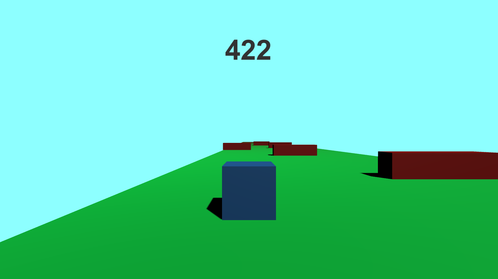

# Cubirun

A simple 3D obstacle-running game built with **Unity** and **C#**.

The player controls a blue cube moving across a platform and must avoid the obstacles placed along the course. The score increases as the run continues, making the objective simple: stay on the platform, avoid collisions, and achieve the highest score possible.



## Gameplay

- Control a cube moving through a 3D obstacle course
- Move sideways to avoid incoming obstacles
- Stay on the platform and avoid falling
- Continue running to increase your score
- Restart and try to beat your previous result

## Built With

- Unity
- C#
- Unity physics and collision system
- Unity UI for the score display

## Getting Started

### Requirements

- Windows

### Run the project

1. Clone the repository:

```bash
git clone https://github.com/MichelN5/Cubirun.git
cd Cubirun
```

2. Open the `Cubirun` folder.
3. Run `Cubirun.exe`.

Keep `Cubirun.exe` beside `Cubirun_Data`, `UnityPlayer.dll`, `UnityCrashHandler32.exe`, and `MonoBleedingEdge` so the Unity build can find its runtime files.

## Project Structure

This repository contains a Windows Unity build:

```text
Cubirun/          Built game executable and Unity runtime files
docs/             README images and supporting project assets
```

The Unity source project is not included in this repository.

## Project Scope

Cubirun is a small learning project focused on fundamental Unity concepts:

- Player movement
- Physics and collisions
- Obstacle placement
- Camera positioning
- Score tracking
- Basic 3D level design

## Author

Developed by [Michel Naouss](https://github.com/MichelN5).
